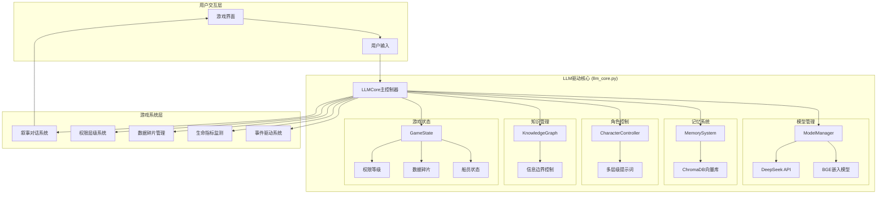
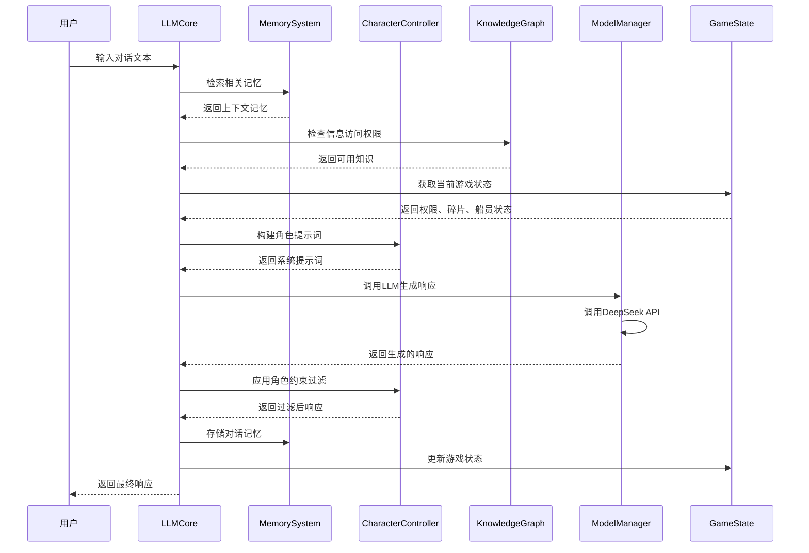
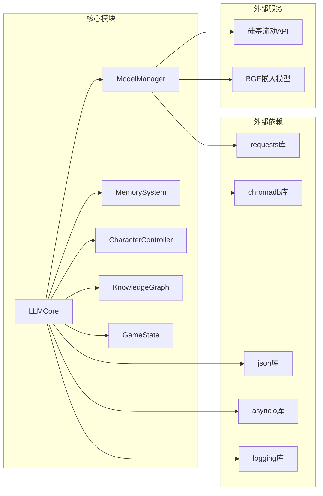
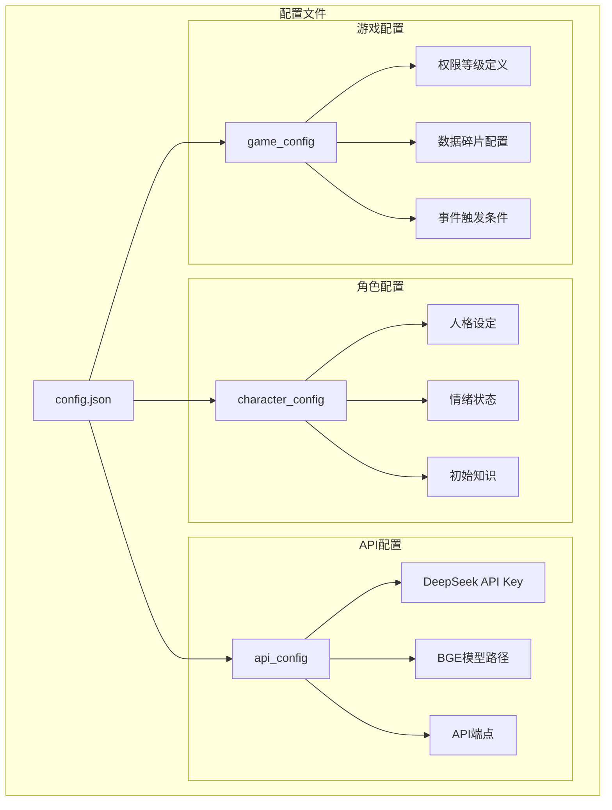

# LLM驱动AVG游戏 - 系统架构图

## 整体系统架构



## 核心类关系图

```mermaid
classDiagram
    class LLMCore {
        +ModelManager model_manager
        +MemorySystem memory_system
        +CharacterController character_controller
        +KnowledgeGraph knowledge_graph
        +GameState game_state
        +process_input(text) str
        +update_game_state()
        +get_character_response(input, context)
    }
    
    class ModelManager {
        +str deepseek_api_key
        +str bge_model_path
        +call_deepseek_api(prompt) str
        +get_embeddings(text) list
        +handle_api_error(error)
    }
    
    class MemorySystem {
        +ChromaDB client
        +str collection_name
        +store_memory(text, metadata)
        +retrieve_memories(query, limit) list
        +update_memory(id, content)
        +delete_memory(id)
    }
    
    class CharacterController {
        +dict character_config
        +dict prompt_templates
        +build_system_prompt() str
        +apply_character_constraints(response) str
        +update_character_state(emotion, health)
    }
    
    class KnowledgeGraph {
        +dict known_information
        +dict access_permissions
        +check_information_access(info_id) bool
        +unlock_information(info_id)
        +get_available_knowledge() list
    }
    
    class GameState {
        +int permission_level
        +list data_fragments
        +dict crew_status
        +dict current_location
        +update_permission(level)
        +add_fragment(fragment)
        +update_crew_status(status)
        +trigger_events() list
    }
    
    LLMCore --> ModelManager
    LLMCore --> MemorySystem
    LLMCore --> CharacterController
    LLMCore --> KnowledgeGraph
    LLMCore --> GameState
    
    ModelManager --> "DeepSeek API"
    ModelManager --> "BGE Model"
    MemorySystem --> "ChromaDB"
```

## 数据流程图



## 模块依赖关系



## 配置文件结构

