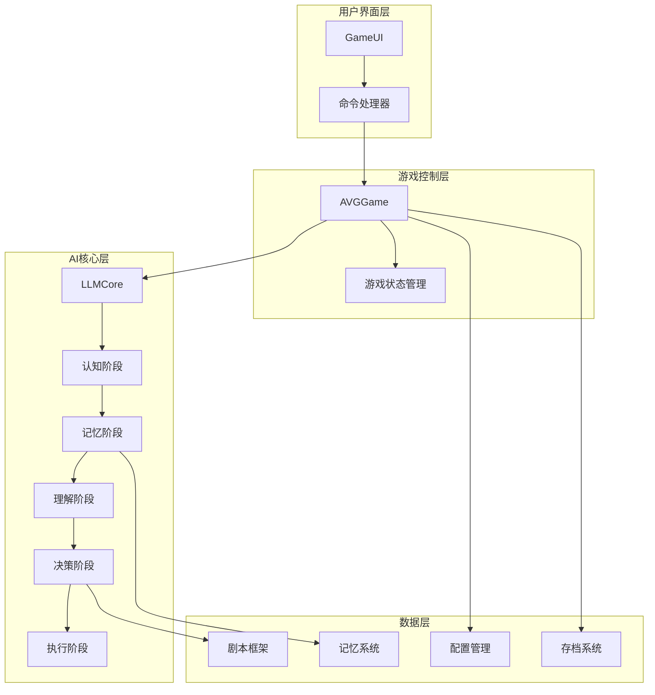
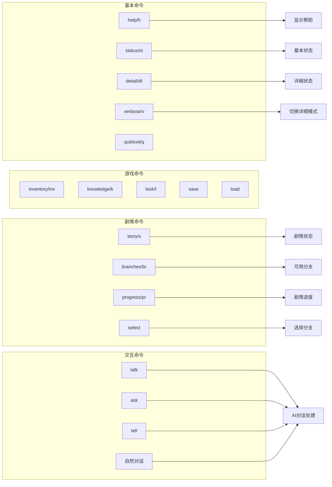
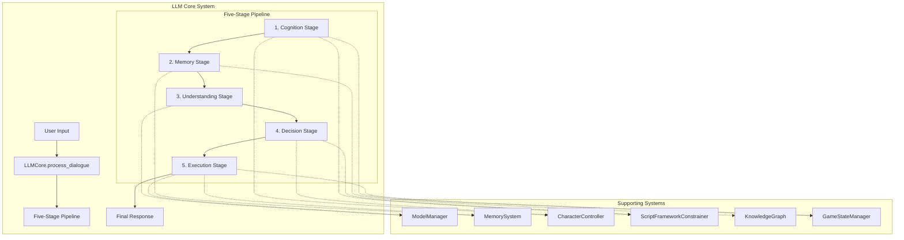
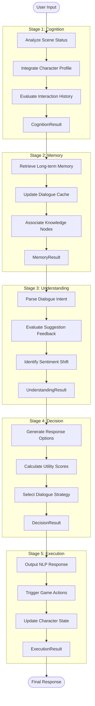
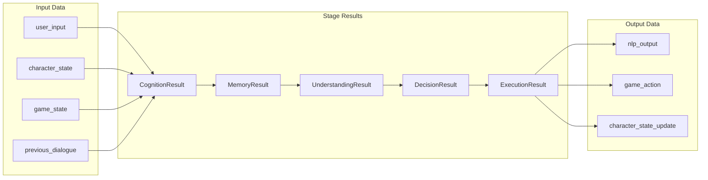
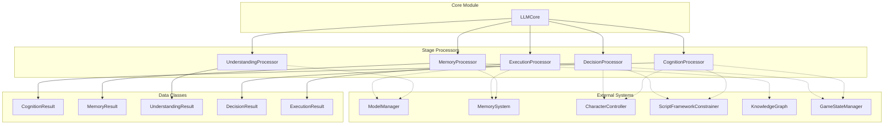
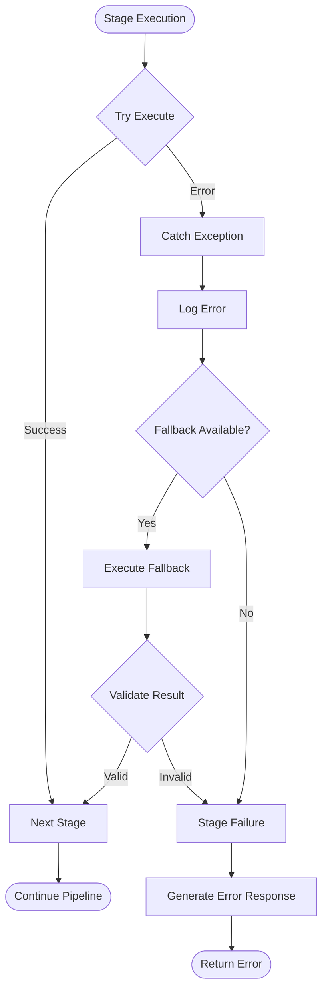
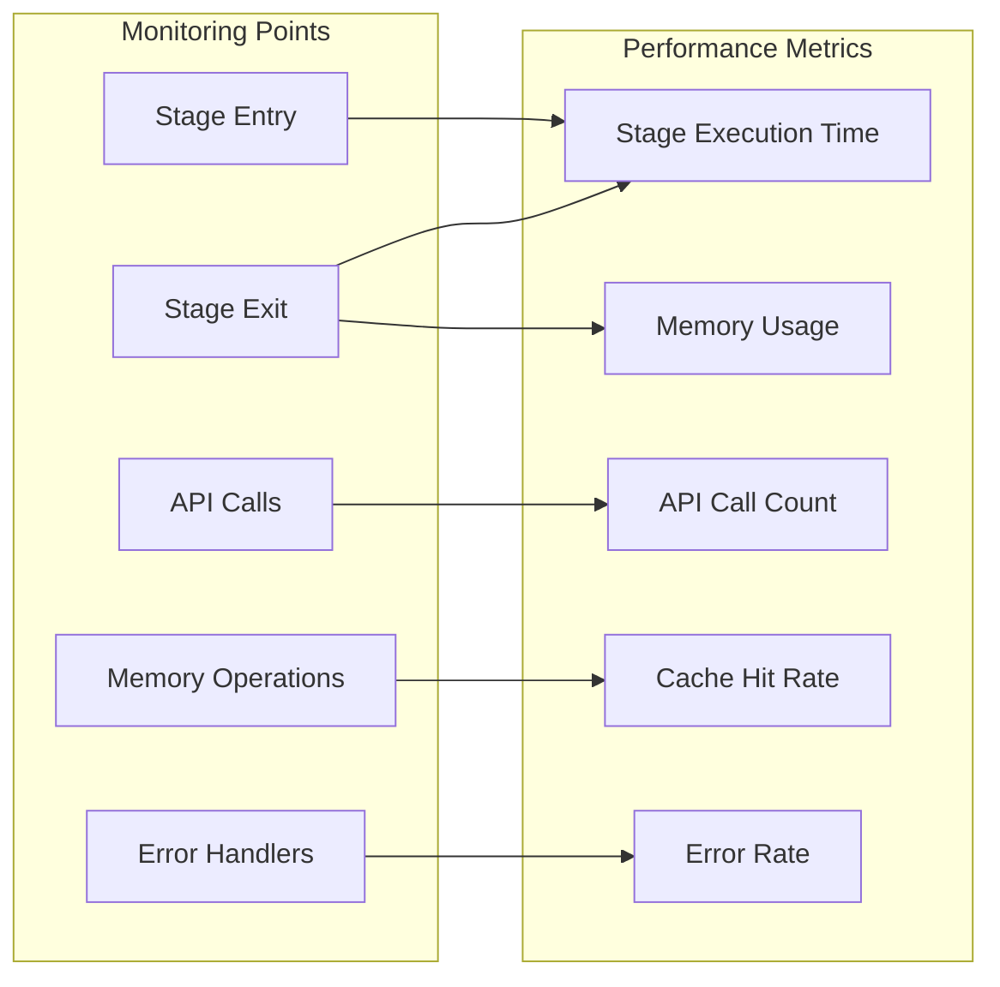
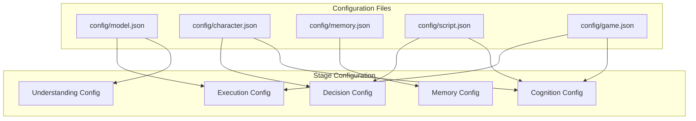

# 项目架构图

## 整体系统架构

## 五阶段架构详细流程

```mermaid
flowchart TD
    INPUT[用户输入] --> COGNITION[认知阶段]
    
    subgraph "认知阶段处理"
        COGNITION --> PARSE[输入解析]
        PARSE --> INTENT[意图识别]
        INTENT --> CONFIDENCE[置信度评估]
    end
    
    CONFIDENCE --> MEMORY[记忆阶段]
    
    subgraph "记忆阶段处理"
        MEMORY --> RETRIEVE[检索相关记忆]
        RETRIEVE --> KNOWLEDGE[知识图谱查询]
        KNOWLEDGE --> CONTEXT[上下文构建]
    end
    
    CONTEXT --> UNDERSTANDING[理解阶段]
    
    subgraph "理解阶段处理"
        UNDERSTANDING --> ANALYZE[情境分析]
        ANALYZE --> EMOTION[情感理解]
        EMOTION --> GOAL[目标识别]
    end
    
    GOAL --> DECISION[决策阶段]
    
    subgraph "决策阶段处理"
        DECISION --> STRATEGY[策略选择]
        STRATEGY --> SCRIPT_CHECK[剧本约束检查]
        SCRIPT_CHECK --> ACTION[行动规划]
    end
    
    ACTION --> EXECUTION[执行阶段]
    
    subgraph "执行阶段处理"
        EXECUTION --> GENERATE[响应生成]
        GENERATE --> VALIDATE[响应验证]
        VALIDATE --> OUTPUT[最终输出]
    end
    
    OUTPUT --> STORE[存储交互记录]
    STORE --> UPDATE[更新游戏状态]
```

## 命令系统架构

## 系统整体架构

## 五阶段详细流程

## 数据流向图

## 模块依赖关系

## 错误处理流程

## 性能监控点

## 配置管理

---

**架构设计说明:**

1. **模块化设计**: 每个阶段都是独立的处理单元，便于维护和测试
2. **数据驱动**: 明确的数据结构定义，确保阶段间数据传递的一致性
3. **错误隔离**: 每个阶段都有独立的错误处理机制
4. **性能监控**: 关键节点都有性能监控，便于优化
5. **配置化**: 支持通过配置文件调整各阶段的行为
6. **可扩展性**: 新功能可以作为新阶段插入，或在现有阶段中扩展

**版本**: v1.0  
**创建时间**: 2025-09-10  
**更新时间**: 2025-09-10
