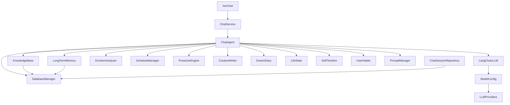
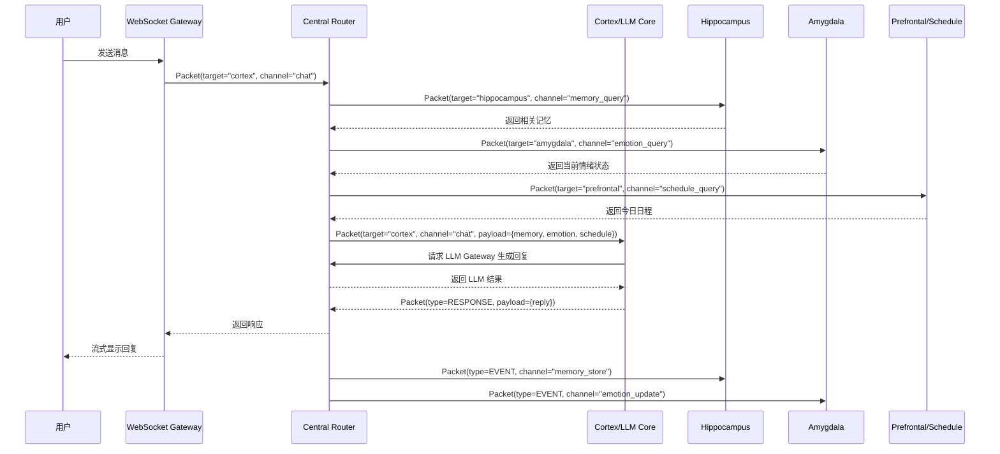
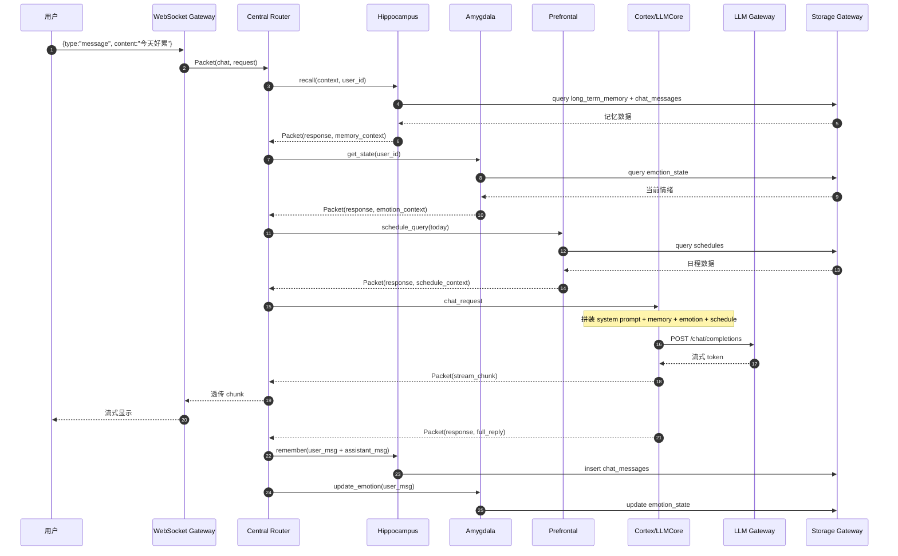
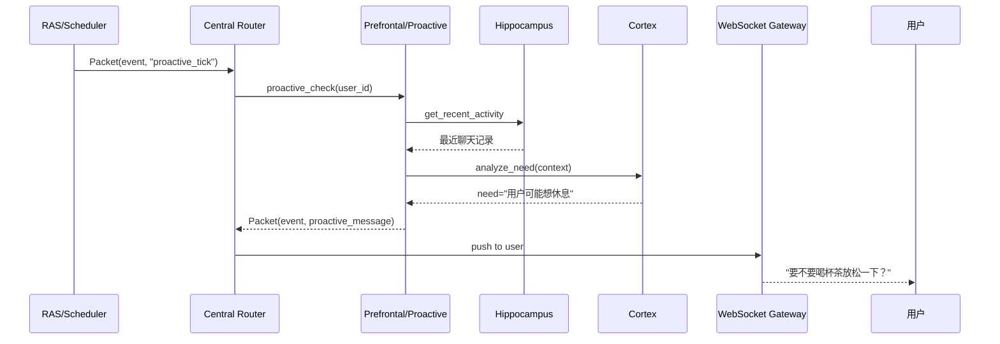
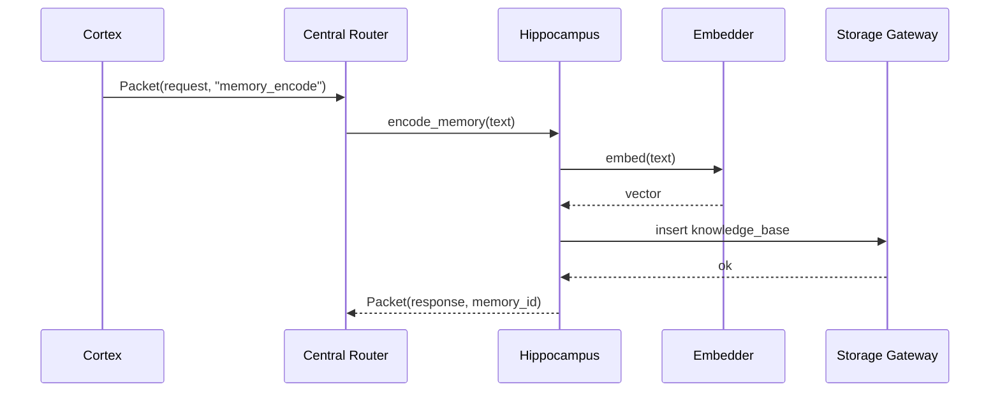
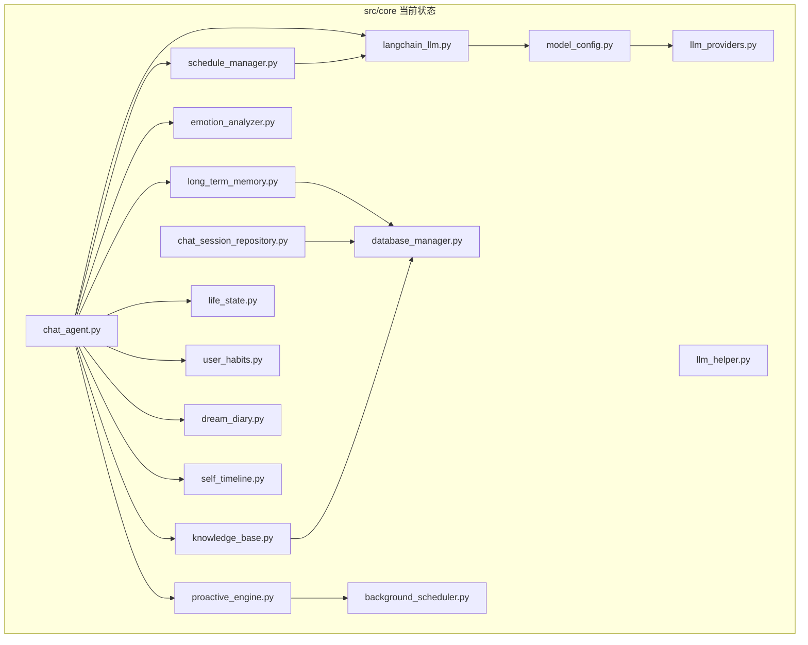
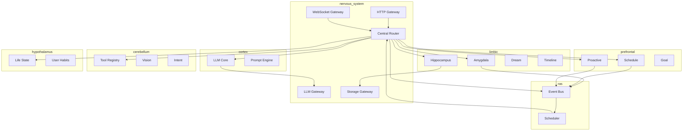

# Neo_Agent 架构重构方案 v4.0

> 基于人脑结构与认知理论的拟人化 AI 系统重构设计
> 版本：v1.0
> 日期：2026-07-16
> 作者：HeDaas

---

## 一、文档说明

### 1.1 编写目的

当前 Neo_Agent v3.1.0 已完成功能验证，但随着模块数量快速增长（`src/core/` 30+ 模块、`src/web/backend/` 40+ 文件、前端 60+ 组件），出现了以下结构性问题：

- **模块职责边界模糊**：`chat_agent.py` 膨胀为 70K+ 行（Mixin 模式导致），既负责对话理解、又负责工具调度、又负责情感分析。
- **LLM 相关模块分散**：`langchain_llm.py`、`model_config.py`、`llm_providers.py`、`llm_helper.py` 之间循环依赖风险高。
- **拟人化模块缺乏统一归属**：`emotion_analyzer.py`、`life_state.py`、`dream_diary.py`、`self_timeline.py`、`user_habits.py` 等模块平铺，没有认知层级。
- **数据流向不可追踪**：内部调用多为直接方法调用，缺乏统一的请求上下文、日志追踪、权限校验。
- **外部访问入口不统一**：HTTP、WebSocket、LLM API、文件系统访问混用，缺少网关层。

本方案提出以**人脑功能组织**为隐喻的抽象层设计，将系统重构为高内聚、低耦合、可追踪、可扩展的架构。

### 1.2 适用范围

- `src/core/`：所有业务核心模块
- `src/web/backend/`：Web 后端适配层
- `src/tools/`：工具集
- `src/gui/`：Tkinter GUI（未来统一走网关）
- 前端 `src/web/frontend/`：调用方式不变，底层由网关统一

### 1.3 术语表

| 术语 | 说明 |
|---|---|
| 大脑皮层（Cortex） | LLM 抽象层，所有推理、生成、理解能力的统一入口 |
| 海马体（Hippocampus） | 记忆与会话管理层，负责长期记忆、短期会话、记忆检索 |
| 杏仁核（Amygdala） | 情感与动机层，负责情绪分析、情感状态维护 |
| 前额叶（Prefrontal Cortex） | 规划与决策层，负责日程、目标、计划、主动行为 |
| 小脑（Cerebellum） | 工具与反射层，负责工具调用、视觉处理、快速反射 |
| 脑干/脊髓（Brainstem/Spinal Cord） | 数据路由与网关层，负责所有内部数据流和外部访问 |
| 网状激活系统（RAS） | 背景调度与注意力管理，负责 proactive 触发 |

---

## 二、现状分析

### 2.1 当前模块清单

#### src/core/（30 个模块）

```
llm_providers.py          # LLM 供应商注册表
model_config.py           # 模型配置
langchain_llm.py          # LangChain LLM 封装
llm_helper.py             # LLM 辅助工具
database_manager.py       # 数据库管理
chat_session_repository.py # 会话仓库
knowledge_base.py         # 知识库
base_knowledge.py         # 知识库基类
long_term_memory.py       # 长期记忆
emotion_analyzer.py       # 情感分析
proactive_engine.py       # 主动引擎
background_scheduler.py   # 后台调度器
event_manager.py          # 事件管理
chat_agent.py             # 聊天代理（核心大脑，但过度膨胀）
creative_writer.py        # 创意写作
dream_diary.py            # 梦境日记
life_state.py             # 生命状态
self_timeline.py          # 自我时间线
user_habits.py            # 用户习惯
schedule_manager.py       # 日程管理
schedule_generator.py     # 日程生成
schedule_similarity_checker.py # 日程相似度
multi_agent_coordinator.py # 多代理协调
dynamic_multi_agent_graph.py # 动态多代理图
deepagents_wrapper.py     # DeepAgents 包装
prompt_manager.py         # 提示词管理
```

#### src/web/backend/（40+ 文件）

```
main.py                   # FastAPI 入口
api/*.py                  # 各业务 REST API
ws/*.py                   # WebSocket 端点
services/*.py             # 后端服务层
schemas/*.py              # Pydantic 模型
```

#### src/tools/（10 个工具）

```
agent_vision.py
schedule_intent_tool.py
expression_style.py
nps_bridge_tool.py
nps_langchain_tools.py
interrupt_question_tool.py
debug_logger.py
settings_migration.py
tooltip_utils.py
```

### 2.2 当前依赖问题



**问题**：`ChatAgent` 处于依赖风暴中心，任何拟人化模块的改动都会影响它。

---

## 三、重构目标

### 3.1 核心目标

1. **以人脑认知理论为指导**，建立清晰的抽象层。
2. **模块聚类**：将相关模块按功能组织为包，而不是平铺文件。
3. **统一数据路由**：所有内部数据流动通过专用管道，可追踪、可审计、可拦截。
4. **统一外部网关**：所有外部访问（HTTP、WebSocket、LLM API、文件系统）通过网关。
5. **向后兼容**：v3.1.0 的 API 接口和数据库保持可用，逐步迁移。
6. **质量保障**：性能不下降，测试覆盖率达到 80% 以上。

### 3.2 设计原则

| 原则 | 说明 |
|---|---|
| 单一职责 | 每个模块只负责一个认知功能 |
| 依赖倒置 | 高层模块不依赖低层实现，依赖抽象接口 |
| 事件驱动 | 模块间通过事件总线松耦合通信 |
| 管道化 | 数据流像神经信号一样在管道中传递 |
| 网关控制 | 所有外部交互统一收口，便于鉴权、限流、日志 |
| 可观测 | 每个请求有唯一 trace_id，全链路可追踪 |

---

## 四、设计哲学：人脑认知映射

### 4.1 为什么用人脑隐喻

Neo_Agent 是一个**拟人化 AI 伴侣**，其人设不仅是 UI 层面的，更应该体现在架构层面。用人脑结构命名模块，可以让每个模块的职责一目了然，也便于后续扩展（例如加入"潜意识"、"梦境回放"、"情绪记忆"等高级功能）。

### 4.2 功能映射表

| 人脑结构 | 认知功能 | Neo_Agent 模块职责 | 当前对应文件 |
|---|---|---|---|
| **大脑皮层 Cerebral Cortex** | 高级推理、语言理解、生成 | LLM 推理抽象层 | `langchain_llm.py`、`model_config.py`、`llm_providers.py`、`llm_helper.py` |
| **海马体 Hippocampus** | 记忆编码、存储、检索 | 长期记忆 + 会话管理 | `long_term_memory.py`、`chat_session_repository.py`、`knowledge_base.py` |
| **杏仁核 Amygdala** | 情绪处理、情感记忆 | 情感分析、情绪状态 | `emotion_analyzer.py` |
| **前额叶 Prefrontal Cortex** | 规划、决策、目标管理 | 日程、计划、主动行为 | `schedule_manager.py`、`proactive_engine.py` |
| **小脑 Cerebellum** | 运动协调、反射、自动化 | 工具调用、视觉处理 | `agent_vision.py`、`schedule_intent_tool.py`、`tools/*` |
| **下丘脑 Hypothalamus** | 内稳态、生理节律 | 生命状态、用户习惯 | `life_state.py`、`user_habits.py` |
| **网状激活系统 RAS** | 觉醒、注意力、背景监控 | 后台调度器 | `background_scheduler.py`、`event_manager.py` |
| **边缘系统 Limbic System** | 情感、记忆、动机整合 | 梦境、自我时间线 | `dream_diary.py`、`self_timeline.py` |
| **脑干/脊髓 Brainstem/Spinal Cord** | 信息中继、反射弧 | 数据路由、外部网关 | 新增模块 |

---

## 五、新架构分层

### 5.1 总体架构图

```mermaid
flowchart TB
    subgraph External ["外部世界"]
        U["用户浏览器/APP"]
        LLM_API["LLM OpenAI API"]
        FS["文件系统/数据库"]
    end

    subgraph Gateway ["网关层 Brainstem & Spinal Cord"]
        G_HTTP["HTTP Gateway"]
        G_WS["WebSocket Gateway"]
        G_LLM["LLM Gateway"]
        G_FS["Storage Gateway"]
        Router["Central Router\n数据路由总线"]
    end

    subgraph Cortex ["大脑皮层 Cortex"]
        LLM_Core["LLM Core\n推理/生成/理解"]
        Prompt_Eng["Prompt Engine"]
    end

    subgraph Limbic ["边缘系统 Limbic System"]
        Amygdala["Amygdala\n情感分析"]
        Hippocampus["Hippocampus\n记忆与会话"]
        Dream["Dream Diary\n梦境"]
        Timeline["Self Timeline\n自我时间线"]
    end

    subgraph Frontal ["前额叶 Prefrontal"]
        Schedule["Schedule Manager"]
        Proactive["Proactive Engine"]
        GoalSys["Goal System"]
    end

    subgraph Cerebellum ["小脑 Cerebellum"]
        Tools["Tool Registry"]
        Vision["Vision Tool"]
        Intent["Intent Tool"]
    end

    subgraph RAS ["网状激活系统 RAS"]
        Scheduler["Background Scheduler"]
        EventBus["Event Bus"]
    end

    subgraph Hypothalamus ["下丘脑 Hypothalamus"]
        LifeState["Life State"]
        Habits["User Habits"]
        Homeostasis["Homeostasis"]
    end

    U -->|"HTTP/WebSocket"| G_HTTP
    U -->|"WebSocket"| G_WS
    G_HTTP --> Router
    G_WS --> Router

    Router -->|"reasoning request"| LLM_Core
    Router -->|"memory query"| Hippocampus
    Router -->|"emotion update"| Amygdala
    Router -->|"schedule task"| Schedule
    Router -->|"proactive trigger"| Proactive
    Router -->|"tool call"| Tools
    Router -->|"life state update"| LifeState

    LLM_Core -->|"chat/completions"| G_LLM
    G_LLM -->|"HTTP"| LLM_API

    Hippocampus -->|"read/write"| G_FS
    G_FS -->|"SQL/SQLite"| FS

    Amygdala --> EventBus
    Schedule --> EventBus
    Proactive --> EventBus
    LifeState --> EventBus
    Tools --> EventBus

    EventBus -->|"wake up / attention"| RAS
    Scheduler -->|"trigger"| Router
```



### 5.2 分层说明

#### 第 0 层：网关层（Brainstem & Spinal Cord）

所有外部交互的收口。包括：

- `HTTP Gateway`：REST API 统一入口
- `WebSocket Gateway`：长连接统一入口
- `LLM Gateway`：所有 LLM API 调用
- `Storage Gateway`：数据库、文件、缓存访问
- `Central Router`：内部数据路由总线

**核心价值**：
- 所有请求标准化（统一 Request/Response 格式）
- 统一鉴权、限流、日志、trace
- 外部依赖可替换（今天用 SiliconFlow，明天换 OpenAI，只改网关）

#### 第 1 层：大脑皮层（Cerebral Cortex）

系统的"智能核心"，负责所有需要 LLM 推理的地方。

- `LLM Core`：统一的 LLM 调用接口，隐藏 langchain/openai 细节
- `Prompt Engine`：提示词模板管理、渲染、版本控制

#### 第 2 层：边缘系统（Limbic System）

负责情感、记忆、梦境、自我叙事等"感性"功能。

- `Hippocampus`：记忆编码、检索、会话管理
- `Amygdala`：情绪识别、情绪状态维护
- `Dream Diary`：梦境生成与回放
- `Self Timeline`：自我时间线、人生叙事

#### 第 3 层：前额叶（Prefrontal Cortex）

负责规划、决策、目标、主动行为。

- `Schedule Manager`：日程规划、提醒、冲突检测
- `Proactive Engine`：主动触发、未满足需求识别
- `Goal System`：目标管理、长期规划

#### 第 4 层：小脑（Cerebellum）

负责工具调用、反射、视觉等"自动化"能力。

- `Tool Registry`：工具注册、发现、调用
- `Vision Tool`：视觉理解、环境切换检测
- `Intent Tool`：意图识别（日程意图等）

#### 第 5 层：下丘脑（Hypothalamus）

负责内稳态、生理节律、用户习惯。

- `Life State`：生命状态（情绪基线、能量、疲劳度）
- `User Habits`：用户习惯学习
- `Homeostasis`：内稳态调节

#### 第 6 层：网状激活系统（RAS）

负责背景调度、注意力、事件总线。

- `Event Bus`：内部事件总线
- `Background Scheduler`：后台任务调度

---

## 六、模块划分与包结构设计

### 6.1 新包结构

```
Neo_Agent/
├── src/
│   ├── nervous_system/              # 神经系统：网关 + 路由（新增）
│   │   ├── __init__.py
│   │   ├── gateway/                 # 外部网关
│   │   │   ├── __init__.py
│   │   │   ├── http_gateway.py      # HTTP 统一入口
│   │   │   ├── ws_gateway.py        # WebSocket 统一入口
│   │   │   ├── llm_gateway.py       # LLM API 统一入口
│   │   │   └── storage_gateway.py   # 存储统一入口
│   │   ├── router/                  # 内部数据路由
│   │   │   ├── __init__.py
│   │   │   ├── central_router.py    # 中央路由器
│   │   │   ├── packet.py            # 数据包格式
│   │   │   └── pipeline.py          # 管道/中间件
│   │   └── security/                # 安全与审计
│   │       ├── __init__.py
│   │       ├── access_control.py    # 访问控制
│   │       └── audit_logger.py      # 审计日志
│   │
│   ├── cortex/                      # 大脑皮层：LLM 推理层
│   │   ├── __init__.py
│   │   ├── llm_core.py              # LLM 核心抽象（替代 langchain_llm.py）
│   │   ├── providers/               # 供应商实现
│   │   │   ├── __init__.py
│   │   │   ├── openai_compatible.py # OpenAI 兼容实现
│   │   │   └── registry.py          # 供应商注册表
│   │   ├── config/                  # 配置
│   │   │   ├── __init__.py
│   │   │   ├── model_config.py      # 模型配置
│   │   │   └── provider_config.py   # 供应商配置
│   │   └── prompt_engine.py         # 提示词引擎
│   │
│   ├── limbic/                      # 边缘系统：情感与记忆
│   │   ├── __init__.py
│   │   ├── hippocampus/             # 海马体：记忆与会话
│   │   │   ├── __init__.py
│   │   │   ├── memory_store.py      # 长期记忆存储（原 long_term_memory.py）
│   │   │   ├── session_store.py     # 会话存储（原 chat_session_repository.py）
│   │   │   └── knowledge_store.py   # 知识库存储（原 knowledge_base.py）
│   │   ├── amygdala/                # 杏仁核：情感
│   │   │   ├── __init__.py
│   │   │   ├── emotion_wheel.py     # Plutchik 情绪轮
│   │   │   └── emotion_state.py     # 情绪状态维护
│   │   ├── dream/                   # 梦境
│   │   │   ├── __init__.py
│   │   │   └── diary.py             # 梦境日记
│   │   └── timeline/                # 自我时间线
│   │       ├── __init__.py
│   │       └── self_timeline.py     # 自我时间线
│   │
│   ├── prefrontal/                  # 前额叶：规划与决策
│   │   ├── __init__.py
│   │   ├── schedule/                # 日程
│   │   │   ├── __init__.py
│   │   │   ├── manager.py           # 日程管理
│   │   │   ├── generator.py         # 日程生成
│   │   │   └── similarity.py        # 相似度检查
│   │   ├── proactive/               # 主动引擎
│   │   │   ├── __init__.py
│   │   │   ├── engine.py            # 主动引擎
│   │   │   └── trigger.py           # 触发器
│   │   └── goal/                    # 目标系统
│   │       ├── __init__.py
│   │       └── manager.py           # 目标管理
│   │
│   ├── cerebellum/                  # 小脑：工具与反射
│   │   ├── __init__.py
│   │   ├── registry.py              # 工具注册表
│   │   ├── vision/                  # 视觉
│   │   │   ├── __init__.py
│   │   │   └── agent_vision.py      # 视觉代理
│   │   └── intent/                  # 意图
│   │       ├── __init__.py
│   │       └── schedule_intent.py   # 日程意图
│   │
│   ├── hypothalamus/                # 下丘脑：内稳态与习惯
│   │   ├── __init__.py
│   │   ├── life_state.py            # 生命状态
│   │   ├── user_habits.py           # 用户习惯
│   │   └── homeostasis.py           # 内稳态调节
│   │
│   ├── ras/                         # 网状激活系统：调度与事件
│   │   ├── __init__.py
│   │   ├── event_bus.py             # 事件总线（原 event_manager.py）
│   │   └── scheduler.py             # 后台调度器（原 background_scheduler.py）
│   │
│   ├── persona/                     # 人格与叙事（新增）
│   │   ├── __init__.py
│   │   ├── identity.py              # AI 身份设定
│   │   └── narrative.py             # 叙事一致性
│   │
│   └── web/                         # Web 适配层（保留，依赖 nervous_system）
│       ├── backend/
│       │   ├── main.py
│       │   ├── api/
│       │   ├── ws/
│       │   └── services/
│       └── frontend/
│
├── tests/                           # 测试体系
│   ├── unit/
│   ├── integration/
│   ├── system/
│   └── perf/
│
└── docs/                            # 文档体系
    ├── architecture/
    ├── modules/
    ├── api/
    └── migration/
```

### 6.2 旧文件迁移映射

| 原文件 | 新位置 | 说明 |
|---|---|---|
| `src/core/langchain_llm.py` | `src/cortex/llm_core.py` | 保留核心逻辑，抽象为 `LLMCore` |
| `src/core/model_config.py` | `src/cortex/config/model_config.py` | 配置层 |
| `src/core/llm_providers.py` | `src/cortex/providers/registry.py` | 供应商注册表 |
| `src/core/llm_helper.py` | `src/cortex/llm_core.py`（合并） | 合并重复工具 |
| `src/core/long_term_memory.py` | `src/limbic/hippocampus/memory_store.py` | 长期记忆 |
| `src/core/chat_session_repository.py` | `src/limbic/hippocampus/session_store.py` | 会话存储 |
| `src/core/knowledge_base.py` | `src/limbic/hippocampus/knowledge_store.py` | 知识库 |
| `src/core/emotion_analyzer.py` | `src/limbic/amygdala/emotion_wheel.py` | 情感分析 |
| `src/core/schedule_manager.py` | `src/prefrontal/schedule/manager.py` | 日程管理 |
| `src/core/schedule_generator.py` | `src/prefrontal/schedule/generator.py` | 日程生成 |
| `src/core/schedule_similarity_checker.py` | `src/prefrontal/schedule/similarity.py` | 相似度 |
| `src/core/proactive_engine.py` | `src/prefrontal/proactive/engine.py` | 主动引擎 |
| `src/core/background_scheduler.py` | `src/ras/scheduler.py` | 调度器 |
| `src/core/event_manager.py` | `src/ras/event_bus.py` | 事件总线 |
| `src/core/life_state.py` | `src/hypothalamus/life_state.py` | 生命状态 |
| `src/core/user_habits.py` | `src/hypothalamus/user_habits.py` | 用户习惯 |
| `src/core/dream_diary.py` | `src/limbic/dream/diary.py` | 梦境日记 |
| `src/core/self_timeline.py` | `src/limbic/timeline/self_timeline.py` | 自我时间线 |
| `src/core/agent_vision.py` | `src/cerebellum/vision/agent_vision.py` | 视觉工具 |
| `src/core/schedule_intent_tool.py` | `src/cerebellum/intent/schedule_intent.py` | 日程意图 |
| `src/core/chat_agent.py` | 拆分到各层 | 大脑皮层 + 边缘系统 + 前额叶 |
| `src/core/database_manager.py` | `src/nervous_system/gateway/storage_gateway.py` | 存储网关 |

---

## 七、统一数据路由系统

### 7.1 设计目标

- 所有内部模块间通信通过 `Central Router`。
- 每个数据包携带 `trace_id`、`source`、`target`、`payload`、`metadata`。
- 支持同步调用、异步调用、事件发布订阅。
- 支持中间件（鉴权、日志、限流、熔断）。

### 7.2 数据包格式

```python
from dataclasses import dataclass, field
from typing import Any, Dict, Optional
from enum import Enum

class PacketType(Enum):
    REQUEST = "request"      # 同步/异步请求
    EVENT = "event"          # 事件发布
    RESPONSE = "response"    # 响应
    ERROR = "error"          # 错误

class Priority(Enum):
    LOW = 0
    NORMAL = 1
    HIGH = 2
    CRITICAL = 3

@dataclass
class Packet:
    trace_id: str            # 全链路追踪 ID
    source: str              # 来源模块 ID
    target: str              # 目标模块 ID（EVENT 可为空）
    packet_type: PacketType  # 数据包类型
    channel: str             # 业务通道（chat/memory/schedule/emotion）
    payload: Dict[str, Any]  # 业务数据
    metadata: Dict[str, Any] = field(default_factory=dict)
    priority: Priority = Priority.NORMAL
    timestamp: float = field(default_factory=time.time)
```

### 7.3 中央路由器接口

```python
class CentralRouter:
    """
    中央路由器：系统内部所有数据流的中枢。
    """

    async def route(self, packet: Packet) -> Packet:
        """
        路由一个数据包到目标模块，返回响应。
        """
        ...

    def subscribe(self, module_id: str, channel: str, handler: Callable):
        """
        订阅某个通道的事件。
        """
        ...

    def publish(self, packet: Packet) -> None:
        """
        发布事件，不等待响应。
        """
        ...

    def register_module(self, module_id: str, module: BaseModule):
        """
        注册一个功能模块。
        """
        ...

    def add_middleware(self, middleware: Middleware):
        """
        添加中间件。
        """
        ...
```

### 7.4 管道中间件示例

```python
class TraceMiddleware(Middleware):
    async def process(self, packet: Packet, next_handler):
        packet.metadata.setdefault("hops", []).append(self.name)
        return await next_handler(packet)

class AuditMiddleware(Middleware):
    async def process(self, packet: Packet, next_handler):
        logger.info(f"[{packet.trace_id}] {packet.source} -> {packet.target}")
        return await next_handler(packet)

class AuthMiddleware(Middleware):
    async def process(self, packet: Packet, next_handler):
        if packet.target in PROTECTED_MODULES:
            if not packet.metadata.get("user_id"):
                return Packet.error(packet, "unauthorized")
        return await next_handler(packet)
```

### 7.5 数据流示例



---

## 八、统一外部访问网关

### 8.1 外部访问分类

| 类型 | 当前实现 | 网关化后 |
|---|---|---|
| 用户 HTTP 请求 | FastAPI 路由直接处理 | HTTP Gateway → Central Router |
| 用户 WebSocket | ws/chat.py 直接处理 | WebSocket Gateway → Central Router |
| LLM API | langchain_llm.py 直接调用 | LLM Gateway 统一调用 |
| 数据库 | database_manager.py 直接连接 | Storage Gateway 统一管理 |
| 文件系统 | 各模块自行读写 | Storage Gateway 统一接口 |

### 8.2 网关层设计

```python
class BaseGateway(ABC):
    @abstractmethod
    async def start(self): ...

    @abstractmethod
    async def stop(self): ...

    @abstractmethod
    async def handle(self, request: GatewayRequest) -> GatewayResponse: ...

class HTTPGateway(BaseGateway):
    """HTTP 网关：将 REST 请求转换为内部 Packet。"""

class WebSocketGateway(BaseGateway):
    """WebSocket 网关：管理长连接，将消息转为 Packet。"""

class LLMGateway(BaseGateway):
    """LLM 网关：统一调用 OpenAI/DeepSeek/SiliconFlow 等。"""

class StorageGateway(BaseGateway):
    """存储网关：统一访问 SQLite/文件/缓存。"""
```

### 8.3 LLM Gateway 详细设计

```python
class LLMGateway:
    """
    所有 LLM 调用的唯一入口。
    职责：
    - 统一封装 chat/completions、embedding、vision
    - 负载均衡、重试、熔断
    - 成本统计、token 计数
    - 响应缓存
    """

    async def chat(
        self,
        messages: List[Message],
        model: str,
        temperature: float = 0.7,
        max_tokens: Optional[int] = None,
        stream: bool = False,
        trace_id: Optional[str] = None,
    ) -> Union[str, AsyncIterator[str]]:
        ...

    async def embed(self, texts: List[str], model: str) -> List[List[float]]:
        ...

    async def vision(self, image: bytes, prompt: str, model: str) -> str:
        ...
```

### 8.4 Storage Gateway 详细设计

```python
class StorageGateway:
    """
    所有持久化访问的唯一入口。
    职责：
    - 统一 SQLite 连接池
    - 事务管理
    - 迁移管理
    - 审计日志
    """

    def get_repository(self, repo_type: Type[R]) -> R:
        """按类型返回仓库实例。"""
        ...

    def transaction(self) -> contextmanager:
        """提供事务上下文。"""
        ...
```

---

## 九、接口设计

### 9.1 模块基类

```python
from abc import ABC, abstractmethod
from typing import Any, Dict

class BaseModule(ABC):
    """
    所有功能模块的基类。
    """

    module_id: str
    module_type: str

    def __init__(self, router: CentralRouter):
        self.router = router

    @abstractmethod
    async def initialize(self): ...

    @abstractmethod
    async def shutdown(self): ...

    @abstractmethod
    async def handle(self, packet: Packet) -> Packet: ...

    async def emit(self, channel: str, payload: Dict[str, Any]):
        """发布事件。"""
        packet = Packet(
            trace_id=generate_trace_id(),
            source=self.module_id,
            target="",
            packet_type=PacketType.EVENT,
            channel=channel,
            payload=payload,
        )
        self.router.publish(packet)
```

### 9.2 大脑皮层接口

```python
class ILLMCore(BaseModule):
    @abstractmethod
    async def chat(self, packet: Packet) -> Packet: ...

    @abstractmethod
    async def summarize(self, packet: Packet) -> Packet: ...

    @abstractmethod
    async def embed(self, packet: Packet) -> Packet: ...
```

### 9.3 海马体接口

```python
class IHippocampus(BaseModule):
    @abstractmethod
    async def remember(self, packet: Packet) -> Packet: ...

    @abstractmethod
    async def recall(self, packet: Packet) -> Packet: ...

    @abstractmethod
    async def create_session(self, packet: Packet) -> Packet: ...

    @abstractmethod
    async def get_session(self, packet: Packet) -> Packet: ...
```

### 9.4 杏仁核接口

```python
class IAmygdala(BaseModule):
    @abstractmethod
    async def analyze_emotion(self, packet: Packet) -> Packet: ...

    @abstractmethod
    async def get_state(self, packet: Packet) -> Packet: ...

    @abstractmethod
    async def update_state(self, packet: Packet) -> Packet: ...
```

### 9.5 前额叶接口

```python
class IPrefrontal(BaseModule):
    @abstractmethod
    async def plan(self, packet: Packet) -> Packet: ...

    @abstractmethod
    async def manage_schedule(self, packet: Packet) -> Packet: ...

    @abstractmethod
    async def proactive_check(self, packet: Packet) -> Packet: ...
```

### 9.6 小脑接口

```python
class ICerebellum(BaseModule):
    @abstractmethod
    async def execute_tool(self, packet: Packet) -> Packet: ...

    @abstractmethod
    async def list_tools(self, packet: Packet) -> Packet: ...
```

---

## 十、数据流程设计

### 10.1 用户聊天完整流程



### 10.2 主动触发流程



### 10.3 记忆写入流程



---

## 十一、向后兼容过渡方案

### 11.1 兼容性策略

采用"**新增包 + 适配层 + 逐步迁移**"的策略，不一次性删除旧模块。

#### 阶段 1：新建神经系统（v4.0-alpha）

- 新增 `src/nervous_system/`、`src/cortex/`、`src/limbic/` 等新包。
- 旧 `src/core/` 保持不动。
- 新增适配器：`src/core/compat/` 将旧接口桥接到新 Router。

#### 阶段 2：核心模块迁移（v4.0-beta）

- 优先迁移 LLM 相关模块到新 `src/cortex/`。
- `langchain_llm.py` 改为调用 `LLMGateway` 的兼容包装。
- 验证性能不低于 v3.1.0。

#### 阶段 3：拟人化模块迁移（v4.0-rc）

- 将 `emotion_analyzer.py`、`long_term_memory.py` 等迁移到 `src/limbic/`。
- `chat_agent.py` 按功能拆分到各层，原文件保留为 Facade。

#### 阶段 4：完全切换（v4.0.0）

- 删除 `src/core/compat/` 和旧 `src/core/` 中被完全替代的文件。
- 保留 `database_manager.py` 的部分接口作为 Storage Gateway 的底层实现。

### 11.2 数据库兼容性

- 不修改现有表结构。
- 新增表如果必要，使用 Alembic 或类似迁移工具。
- `chat_sessions` / `chat_messages` 表继续复用。

### 11.3 API 兼容性

- 前端 `/api/*` 和 `/ws/*` 路径保持不变。
- `main.py` 中的 router 挂载方式不变。
- 内部由 HTTP Gateway / WebSocket Gateway 转发到 Central Router。

### 11.4 配置兼容性

- 保留 `.env.example` 中所有旧变量。
- 新增变量使用 `NEO_` 前缀，如 `NEO_LLM_GATEWAY_TIMEOUT`。
- `settings_migration.py` 增加从 v3 到 v4 的自动迁移逻辑。

---

## 十二、文档体系

重构过程中需要建立以下文档：

```
docs/
├── architecture/
│   ├── overview.md              # 总体架构
│   ├── nervous_system.md        # 网关与路由
│   ├── cortex.md                # 大脑皮层
│   ├── limbic.md                # 边缘系统
│   ├── prefrontal.md            # 前额叶
│   ├── cerebellum.md            # 小脑
│   ├── hypothalamus.md          # 下丘脑
│   └── ras.md                   # 网状激活系统
├── modules/
│   ├── README.md                # 模块清单
│   └── MODULE_NAME.md           # 每个模块的说明
├── api/
│   ├── gateway.md               # 网关接口
│   ├── router.md                # 路由协议
│   └── modules.md               # 模块间接口
├── migration/
│   ├── v3-to-v4.md              # 迁移指南
│   └── compatibility.md         # 兼容性说明
└── refactor/
    └── plan.md                  # 重构计划
```

---

## 十三、版本控制与代码审查机制

### 13.1 分支策略

```
main
  └── develop
        └── feature/nervous-system
        └── feature/cortex-llm
        └── feature/limbic-memory
        └── feature/prefrontal-schedule
        └── feature/cerebellum-tools
        └── feature/hypothalamus-state
```

### 13.2 提交规范

```
feat(nervous_system): add Central Router and Packet format
refactor(cortex): migrate langchain_llm to llm_core
feat(limbic): add hippocampus memory store
fix(prefrontal): schedule conflict detection
test(integration): add router end-to-end test
docs(api): update gateway interface doc
```

### 13.3 代码审查清单

- [ ] 新模块是否继承 `BaseModule`？
- [ ] 是否通过 `Central Router` 通信，而不是直接方法调用？
- [ ] 是否添加了单元测试？
- [ ] 接口是否有类型注解？
- [ ] 是否有 docstring 说明职责？
- [ ] 是否向后兼容？
- [ ] 是否有性能基准测试？

---

## 十四、测试策略

### 14.1 测试分层

```
tests/
├── unit/                    # 单个模块测试
│   ├── test_cortex_llm_core.py
│   ├── test_limbic_memory.py
│   ├── test_router_packet.py
│   └── test_gateway_llm.py
├── integration/             # 模块间集成测试
│   ├── test_chat_flow.py
│   ├── test_memory_emotion.py
│   ├── test_schedule_proactive.py
│   └── test_gateway_router.py
├── system/                  # 端到端测试
│   ├── test_e2e_chat.py
│   ├── test_e2e_session.py
│   ├── test_e2e_llm_provider.py
│   └── test_e2e_security.py
├── compat/                  # 向后兼容测试
│   ├── test_v3_api.py
│   └── test_v3_env.py
└── perf/                    # 性能测试
    ├── test_llm_latency.py
    ├── test_router_throughput.py
    └── test_db_concurrent.py
```

### 14.2 性能基准

| 指标 | v3.1.0 基线 | v4.0 目标 | 测试方式 |
|---|---|---|---|
| LLM 初始化次数 | 启动时 3 次 | ≤ 3 次 | 启动日志分析 |
| 单次 WS 聊天延迟 | P95 < 500ms | ≤ v3.1.0 | locust/k6 |
| 并发 100 连接 | 无 ERROR | 无 ERROR | perf 测试 |
| 数据库查询次数/请求 | 当前值 | ≤ 当前值 | SQL 日志统计 |
| 包路由开销 | - | < 1ms | 单元测试 |

### 14.3 质量门禁

- 单元测试覆盖率 ≥ 80%
- 集成测试全部通过
- 性能测试不低于 v3.1.0
- 向后兼容测试全部通过
- 代码审查 ≥ 1 人 approve

---

## 十五、实施时间表

### 15.1 总体时间线

| 阶段 | 周期 | 主要工作 | 交付物 |
|---|---|---|---|
| **Phase 0: 准备** | 1 周 | 现状分析、工具选型、团队对齐 | 现状报告、工具链、分支策略 |
| **Phase 1: 神经系统** | 2 周 | 搭建 `nervous_system`：网关、路由、Packet、安全 | Central Router、四大 Gateway、审计日志 |
| **Phase 2: 大脑皮层** | 2 周 | 迁移 LLM 模块到 `cortex/` | LLM Core、Provider Registry、Prompt Engine |
| **Phase 3: 边缘系统** | 2 周 | 迁移记忆、情感、梦境、时间线 | Hippocampus、Amygdala、Dream、Timeline |
| **Phase 4: 前额叶** | 1.5 周 | 迁移日程、主动引擎、目标系统 | Schedule、Proactive、Goal |
| **Phase 5: 小脑 + 下丘脑** | 1.5 周 | 迁移工具、视觉、习惯、生命状态 | Tool Registry、Vision、LifeState、Habits |
| **Phase 6: Web 适配** | 1 周 | 让 Web 层走网关 | HTTP/WS Gateway 接入 |
| **Phase 7: 集成测试** | 1 周 | 单元/集成/性能/兼容测试 | 测试报告、性能基准 |
| **Phase 8: 文档与发布** | 1 周 | 补齐文档、Code Review、发布 v4.0 | 文档体系、CHANGELOG、Release |
| **总计** | **13 周** | - | v4.0.0 |

### 15.2 关键里程碑

- **M1（第 3 周末）**：神经系统可运行，支持简单的 chat 请求路由。
- **M2（第 7 周末）**：Cortex + Limbic 迁移完成，聊天功能完全可用。
- **M3（第 11 周末）**：所有模块迁移完成，集成测试通过。
- **M4（第 13 周末）**：v4.0.0 正式发布。

### 15.3 风险与应对

| 风险 | 影响 | 应对措施 |
|---|---|---|
| 重构周期过长 | 延误 | 分阶段交付，每阶段都有可运行版本 |
| 性能下降 | 严重 | 每阶段做 perf 回归测试，不达标不进入下阶段 |
| 向后兼容破坏 | 严重 | 保留旧 API，适配层覆盖所有 v3 接口 |
| 模块依赖复杂 | 中 | 先定义接口，再实现，依赖注入 + Mock 测试 |
| 团队理解成本 | 中 | 文档先行，人脑隐喻降低认知负担 |
| 新网关引入单点故障 | 中 | 网关内部无状态，支持水平扩展；中间件可插拔 |

---

## 十六、最小可行原型（MVP）

为了验证架构可行性，建议先做一个小范围原型：

### MVP 范围

1. 实现 `nervous_system` 的核心：`CentralRouter` + `Packet`。
2. 实现一个 `EchoCortex` 模块，模拟 LLM 回复。
3. 实现一个 `SimpleHippocampus` 模块，记录最近 10 条消息。
4. 实现 `HTTP Gateway`，暴露 `/api/v4/chat`。
5. 写一个集成测试：用户发消息 → Gateway → Router → Cortex + Hippocampus → 返回回复。

### MVP 验证标准

- 请求能在 50ms 内完成路由。
- 记忆能正确写入和读取。
- 接口文档清晰。

MVP 通过后，再进入完整重构。

---

## 十七、总结

本次重构的核心思想是：

> **把 Neo_Agent 从"功能平铺的脚本集合"升级为"有组织、有层次、可追踪的拟人化认知系统"。**

通过引入：
- **人脑隐喻的抽象层**（大脑皮层、海马体、杏仁核、前额叶等）
- **统一数据路由系统**（Central Router + Packet）
- **统一外部访问网关**（HTTP/WS/LLM/Storage Gateway）
- **严格的向后兼容和测试体系**

最终实现：
- 高内聚低耦合
- 可维护、可扩展
- 性能不下降
- 全链路可追踪

---

## 十八、MVP 实现记录

### 18.1 已实现内容

在 `feature/nervous-system` 分支完成了 v4.0 MVP：

| 组件 | 文件路径 | 状态 |
|---|---|---|
| Packet 数据包 | `src/nervous_system/router/packet.py` | ✅ |
| CentralRouter | `src/nervous_system/router/central_router.py` | ✅ |
| 中间件示例 | `src/nervous_system/router/pipeline.py` | ✅ |
| 模块基类 | `src/nervous_system/base_module.py` | ✅ |
| HTTP Gateway | `src/nervous_system/gateway/http_gateway.py` | ✅ |
| WebSocket Gateway 骨架 | `src/nervous_system/gateway/ws_gateway.py` | ✅ |
| EchoCortex | `src/cortex/echo_cortex.py` | ✅ |
| SimpleHippocampus | `src/limbic/hippocampus/simple_hippocampus.py` | ✅ |
| FastAPI MVP 入口 | `src/nervous_system/app.py` | ✅ |
| 启动脚本 | `run_v4_mvp.py` | ✅ |
| 单元测试 | `tests/unit/nervous_system/*.py` | ✅ |
| 集成测试 | `tests/integration/test_v4_mvp_chat.py` | ✅ |

### 18.2 新增接口验证

启动 MVP：

```bash
cd Neo_Agent
python run_v4_mvp.py
```

测试：

```bash
curl http://localhost:8400/api/v4/health

curl -X POST http://localhost:8400/api/v4/chat \
  -H "Content-Type: application/json" \
  -d '{"content": "你好"}'
```

### 18.3 性能验证结果

```
单元测试：
- CentralRouter 平均路由耗时 < 0.1ms ✅

集成测试：
- /api/v4/chat 平均端到端耗时：0.402ms
- 最大端到端耗时：0.498ms
- 目标 < 50ms ✅
```

### 18.4 测试结果

```bash
python -m pytest tests/unit/nervous_system/test_packet.py \
                 tests/unit/nervous_system/test_central_router.py \
                 tests/integration/test_v4_mvp_chat.py -v
```

结果：**全部通过**（11 passed）

### 18.5 分支信息

- 分支名：`feature/nervous-system`
- 基于：`Dev`
- 提交状态：未提交（待 review 后提交）

---

## 附录 A：当前模块依赖图



## 附录 B：目标模块依赖图


