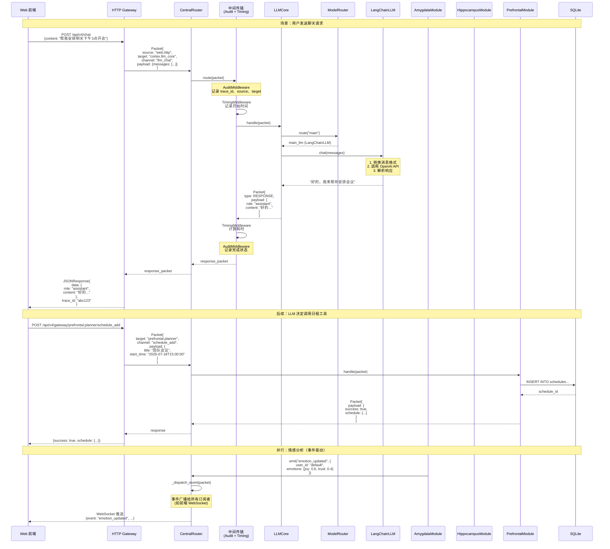
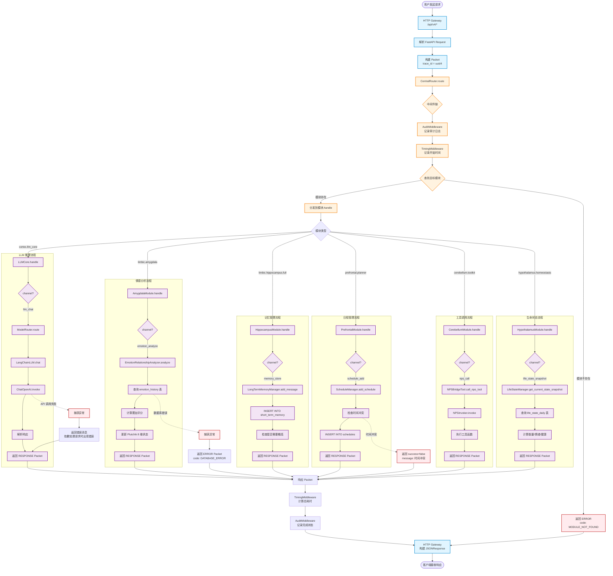

# Neo Agent v4.0 架构全景图

> 基于人脑认知理论的神经系统架构
> 版本：v4.0.0
> 日期：2026-07-17

---

## 一、方法级架构图

展示各模块的核心方法结构，帮助理解每个模块"能做什么"。

```mermaid
classDiagram
    %% 基类
    class BaseModule {
        <<abstract>>
        +module_id: str
        +module_type: str
        +router: CentralRouter
        +initialize() async
        +shutdown() async
        +handle(packet: Packet) Packet*
        +emit(channel, payload) async
        +request(target, channel, payload) async
    }

    %% 大脑皮层 - LLM 推理
    class LLMCore {
        +module_id = "cortex.llm_core"
        -_model_router: ModelRouter
        +handle(packet) Packet
        -_get_model_router() ModelRouter
    }

    class LangChainLLM {
        +model_type: ModelType
        +llm: ChatOpenAI
        +chat(messages) str
        +chat_with_template(template, variables, history) str
        +get_model_info() Dict
        -_convert_messages_to_langchain(messages) List
    }

    class ModelRouter {
        +main_llm: LangChainLLM
        +tool_llm: LangChainLLM
        +vision_llm: LangChainLLM
        +route(task_type) LangChainLLM
        +get_model_by_type(model_type) LangChainLLM
    }

    %% 边缘系统 - 情感与记忆
    class AmygdalaModule {
        +module_id = "limbic.amygdala"
        -_analyzer: EmotionRelationshipAnalyzer
        -_wheel: PlutchikEmotionWheel
        +handle(packet) Packet
        -_handle_analyze(packet, payload) Packet
        -_handle_latest(packet, payload) Packet
        -_handle_trend(packet, payload) Packet
        -_handle_tone(packet, payload) Packet
        -_handle_wheel_profile(packet, payload) Packet
    }

    class HippocampusModule {
        +module_id = "limbic.hippocampus.full"
        -_db: DatabaseManager
        -_session_store: SessionStore
        -_memory_manager: LongTermMemoryManager
        -_knowledge_base: KnowledgeBase
        +handle(packet) Packet
        -_handle_memory_query(packet, payload) Packet
        -_handle_memory_store(packet, payload) Packet
        -_handle_memory_context(packet, payload) Packet
        -_handle_session_create(packet, payload) Packet
        -_handle_session_list(packet, payload) Packet
        -_handle_message_add(packet, payload) Packet
    }

    %% 前额叶 - 规划与决策
    class PrefrontalModule {
        +module_id = "prefrontal.planner"
        -_db: DatabaseManager
        -_schedule_manager: ScheduleManager
        -_event_manager: EventManager
        -_proactive_engine: ProactiveEngine
        +handle(packet) Packet
        -_handle_schedule_list(packet, payload) Packet
        -_handle_schedule_add(packet, payload) Packet
        -_handle_proactive_should_send(packet, payload) Packet
        -_handle_event_list(packet, payload) Packet
        -_handle_event_add(packet, payload) Packet
    }

    %% 小脑 - 工具与反射
    class CerebellumModule {
        +module_id = "cerebellum.toolkit"
        -_vision_tool: AgentVisionTool
        -_schedule_intent_tool: ScheduleIntentTool
        -_interrupt_tool: InterruptQuestionTool
        -_nps_bridge: NPSBridgeTool
        -_expression_manager: ExpressionStyleManager
        +handle(packet) Packet
        -_handle_vision_should_use(packet, payload) Packet
        -_handle_schedule_intent(packet, payload) Packet
        -_handle_nps_call(packet, payload) Packet
        -_handle_expression_agent_add(packet, payload) Packet
    }

    %% 下丘脑 - 内稳态
    class HypothalamusModule {
        +module_id = "hypothalamus.homeostasis"
        -_db: DatabaseManager
        -_life_state: LifeStateManager
        -_habits: UserHabitTracker
        +handle(packet) Packet
        -_handle_life_state_ensure(packet, payload) Packet
        -_handle_life_state_snapshot(packet, payload) Packet
        -_handle_habit_update(packet, payload) Packet
        -_handle_habit_qualified(packet, payload) Packet
    }

    %% 神经系统 - 路由与网关
    class CentralRouter {
        -_modules: Dict~str, BaseModule~
        -_subscribers: Dict~str, List~
        -_middlewares: List~Middleware~
        +register_module(module_id, module)
        +add_middleware(middleware)
        +route(packet) Packet
        +publish(packet) async
        +initialize() async
        +shutdown() async
    }

    class Packet {
        +trace_id: str
        +source: str
        +target: str
        +packet_type: PacketType
        +channel: str
        +payload: Dict
        +metadata: Dict
        +response(payload) Packet
        +error(origin, message, code) Packet
    }

    %% 继承关系
    BaseModule <|-- LLMCore
    BaseModule <|-- AmygdalaModule
    BaseModule <|-- HippocampusModule
    BaseModule <|-- PrefrontalModule
    BaseModule <|-- CerebellumModule
    BaseModule <|-- HypothalamusModule

    %% 组合关系
    LLMCore *-- ModelRouter
    ModelRouter *-- LangChainLLM
    AmygdalaModule *-- EmotionRelationshipAnalyzer
    AmygdalaModule *-- PlutchikEmotionWheel
    HippocampusModule *-- SessionStore
    HippocampusModule *-- LongTermMemoryManager
    PrefrontalModule *-- ScheduleManager
    PrefrontalModule *-- EventManager
    PrefrontalModule *-- ProactiveEngine
    CerebellumModule *-- AgentVisionTool
    CerebellumModule *-- NPSBridgeTool
    HypothalamusModule *-- LifeStateManager
    HypothalamusModule *-- UserHabitTracker

    %% 路由关系
    CentralRouter --> BaseModule : routes to
    BaseModule --> Packet : handles
    BaseModule --> CentralRouter : emits events
```

---

## 二、抽象层图（人脑认知映射）

展示 v4.0 架构如何映射人脑认知功能分区。

```mermaid
graph TB
    subgraph "外部世界"
        WebUI[Web 前端<br/>React]
        APIClient[API 客户端<br/>测试/第三方调用]
        LLM_API[LLM API 调用]
    end

    subgraph "神经系统 - 脑干/脊髓"
        HTTP_GW[HTTP Gateway<br/>/api/v4/*]
        WS_GW[WebSocket Gateway<br/>/ws/*]
        LLM_GW[LLM Gateway<br/>cortex.llm_core]
        Router[CentralRouter<br/>中央路由器]
        Audit[AuditMiddleware<br/>审计日志]
        Timing[TimingMiddleware<br/>性能计时]
    end

    subgraph "大脑皮层 - Cortex"
        LLM_Core[LLMCore<br/>cortex.llm_core<br/>LLM 推理核心 + 工具调用]
        ToolRegistry[ToolRegistry<br/>cortex.tools<br/>工具注册表]
        ModelRouter[ModelRouter<br/>模型路由器]
        MainLLM[Main LLM<br/>主模型]
        ToolLLM[Tool LLM<br/>工具模型]
        VisionLLM[Vision LLM<br/>视觉模型]
    end

    subgraph "边缘系统 - Limbic"
        subgraph "海马体 - Hippocampus"
            HippoFull[HippocampusModule<br/>limbic.hippocampus.full<br/>完整记忆]
            SessionStore[SessionStore<br/>会话存储]
            MemoryMgr[LongTermMemoryManager<br/>长期记忆]
            KnowledgeBase[KnowledgeBase<br/>知识库]
        end
        subgraph "杏仁核 - Amygdala"
            Amyg[AmygdalaModule<br/>limbic.amygdala<br/>情感分析]
            EmotionAnalyzer[EmotionRelationshipAnalyzer<br/>情感关系分析]
            PlutchikWheel[PlutchikEmotionWheel<br/>Plutchik 8 维情绪轮]
        end
    end

    subgraph "前额叶 - Prefrontal"
        Prefrontal[PrefrontalModule<br/>prefrontal.planner<br/>规划与决策]
        ScheduleMgr[ScheduleManager<br/>日程管理]
        EventMgr[EventManager<br/>事件管理]
        ProactiveEngine[ProactiveEngine<br/>主动决策引擎]
    end

    subgraph "小脑 - Cerebellum"
        Cerebellum[CerebellumModule<br/>cerebellum.toolkit<br/>工具与反射]
        VisionTool[AgentVisionTool<br/>视觉工具]
        ScheduleIntent[ScheduleIntentTool<br/>日程意图识别]
        NPSBridge[NPSBridgeTool<br/>NPS 工具桥接]
        ExpressionMgr[ExpressionStyleManager<br/>表达风格管理]
    end

    subgraph "下丘脑 - Hypothalamus"
        Hypothalamus[HypothalamusModule<br/>hypothalamus.homeostasis<br/>内稳态]
        LifeState[LifeStateManager<br/>生命状态管理]
        HabitTracker[UserHabitTracker<br/>用户习惯追踪]
    end

    subgraph "数据库层"
        SQLite[(SQLite<br/>chat_agent.db)]
    end

    %% 外部到网关
    WebUI -->|HTTP POST /api/v4/*| HTTP_GW
    WebUI -->|WebSocket /ws/*| WS_GW
    APIClient -->|直接调用| LLM_API
    LLM_API --> LLM_GW

    %% 网关到路由器
    HTTP_GW --> Router
    WS_GW --> Router
    LLM_GW --> Router

    %% 中间件链
    Router --> Audit --> Timing

    %% 路由器到模块
    Timing --> LLM_Core
    Timing --> Echo
    Timing --> Hippo
    Timing --> HippoFull
    Timing --> Amyg
    Timing --> Prefrontal
    Timing --> Cerebellum
    Timing --> Hypothalamus

    %% 模块内部调用
    LLM_Core --> ModelRouter
    ModelRouter --> MainLLM
    ModelRouter --> ToolLLM
    ModelRouter --> VisionLLM

    HippoFull --> SessionStore
    HippoFull --> MemoryMgr
    HippoFull --> KnowledgeBase

    Amyg --> EmotionAnalyzer
    Amyg --> PlutchikWheel

    Prefrontal --> ScheduleMgr
    Prefrontal --> EventMgr
    Prefrontal --> ProactiveEngine

    Cerebellum --> VisionTool
    Cerebellum --> ScheduleIntent
    Cerebellum --> NPSBridge
    Cerebellum --> ExpressionMgr

    Hypothalamus --> LifeState
    Hypothalamus --> HabitTracker

    %% 数据库访问
    SessionStore --> SQLite
    MemoryMgr --> SQLite
    KnowledgeBase --> SQLite
    ScheduleMgr --> SQLite
    EventMgr --> SQLite
    LifeState --> SQLite
    HabitTracker --> SQLite
```

---

## 三、数据流转图（Packet 流转）

展示一个典型请求中 Packet 如何在各模块间流转。

---

## 四、调用链分析图

展示从用户请求到最终响应的完整调用链路，包含错误处理和降级策略。

---

## 五、模块通道（Channel）速查表

帮助开发者快速定位"我应该调用哪个模块的哪个通道"。

| 模块 ID | 通道 (Channel) | 功能说明 | 典型使用场景 |
|---------|---------------|---------|-------------|
| `cortex.llm_core` | `llm_chat` | 同步 LLM 聊天 | 普通对话回复 |
| `cortex.llm_core` | `llm_stream` | 流式 LLM 聊天 | 长文本生成 |
| `cortex.llm_core` | `llm_template` | 模板化 LLM 调用 | 系统提示词 + 变量 |
| `cortex.llm_core` | `llm_info` | 获取模型信息 | 显示当前模型配置 |
| `limbic.amygdala` | `emotion_analyze` | 分析对话情感关系 | 每轮对话后更新情感 |
| `limbic.amygdala` | `emotion_latest` | 获取最新情感数据 | 显示情感面板 |
| `limbic.amygdala` | `emotion_trend` | 获取情感趋势 | 情感历史图表 |
| `limbic.amygdala` | `emotion_tone` | 生成语气提示 | LLM 回复语气调整 |
| `limbic.amygdala` | `emotion_wheel_profile` | Plutchik 情绪轮推导 | 复合情绪分析 |
| `limbic.hippocampus.full` | `memory_query` | 查询相关记忆 | 检索历史对话 |
| `limbic.hippocampus.full` | `memory_store` | 存储消息 | 保存用户/助手消息 |
| `limbic.hippocampus.full` | `memory_context` | 获取聊天上下文 | 构建 LLM 上下文 |
| `limbic.hippocampus.full` | `memory_stats` | 获取记忆统计 | 显示记忆使用情况 |
| `limbic.hippocampus.full` | `session_create` | 创建会话 | 新建聊天会话 |
| `limbic.hippocampus.full` | `session_list` | 列出会话 | 显示会话列表 |
| `limbic.hippocampus.full` | `session_get` | 获取会话详情 | 加载会话历史 |
| `limbic.hippocampus.full` | `session_delete` | 删除会话 | 删除聊天会话 |
| `limbic.hippocampus.full` | `message_add` | 添加消息 | 保存单条消息 |
| `limbic.hippocampus.full` | `message_list` | 列出消息 | 分页加载消息 |
| `prefrontal.planner` | `schedule_list` | 列出日程 | 显示日程列表 |
| `prefrontal.planner` | `schedule_add` | 创建日程 | 添加新日程 |
| `prefrontal.planner` | `schedule_delete` | 删除日程 | 取消日程 |
| `prefrontal.planner` | `proactive_should_send` | 主动消息决策 | 判断是否发送主动消息 |
| `prefrontal.planner` | `proactive_schedule_next` | 排定下次主动消息 | 设置主动消息时间 |
| `prefrontal.planner` | `event_list` | 列出事件 | 显示事件列表 |
| `prefrontal.planner` | `event_add` | 创建事件 | 添加新事件 |
| `cerebellum.toolkit` | `vision_should_use` | 判断是否使用视觉 | 检测是否需要图像识别 |
| `cerebellum.toolkit` | `vision_context` | 获取视觉上下文 | 识别图像内容 |
| `cerebellum.toolkit` | `vision_summary` | 获取视觉摘要 | 总结图像内容 |
| `cerebellum.toolkit` | `vision_switch` | 切换环境 | 切换虚拟环境 |
| `cerebellum.toolkit` | `schedule_intent` | 识别日程意图 | 从对话提取日程信息 |
| `cerebellum.toolkit` | `interrupt_ask` | 中断提问 | 向用户确认关键信息 |
| `cerebellum.toolkit` | `nps_call` | 调用 NPS 工具 | 执行插件工具 |
| `cerebellum.toolkit` | `nps_list` | 列出 NPS 工具 | 显示可用工具 |
| `cerebellum.toolkit` | `expression_agent_add` | 添加智能体表达 | 学习新表达方式 |
| `cerebellum.toolkit` | `expression_agent_list` | 列出智能体表达 | 显示已学习表达 |
| `cerebellum.toolkit` | `expression_user_learn` | 学习用户表达习惯 | 适应用户语言风格 |
| `cerebellum.toolkit` | `expression_stats` | 获取表达统计 | 显示表达风格分析 |
| `hypothalamus.homeostasis` | `life_state_ensure` | 确保当日状态存在 | 初始化每日状态 |
| `hypothalamus.homeostasis` | `life_state_snapshot` | 获取状态快照 | 显示当前生命状态 |
| `hypothalamus.homeostasis` | `life_state_transition` | 应用状态转移 | 状态变化（如疲劳→休息） |
| `hypothalamus.homeostasis` | `life_state_prompt` | 渲染状态为 prompt | 将状态注入 LLM 提示词 |
| `hypothalamus.homeostasis` | `life_state_body_cycle` | 计算生理周期 | 生物钟模拟 |
| `hypothalamus.homeostasis` | `life_state_consume_dream_delta` | 消费梦境能量差值 | 梦境系统能量管理 |
| `hypothalamus.homeostasis` | `habit_update` | 更新习惯候选 | 从对话学习用户习惯 |
| `hypothalamus.homeostasis` | `habit_qualified` | 获取已确认习惯 | 显示已确认的习惯 |
| `hypothalamus.homeostasis` | `habit_proactive_event` | 触发习惯主动事件 | 基于习惯发送主动消息 |
| `hypothalamus.homeostasis` | `habit_format_schedule` | 渲染习惯为 schedule 格式 | 习惯转日程 |

---

## 六、架构优势总结

### 6.1 高内聚低耦合

- **模块职责清晰**：每个模块对应人脑特定认知功能区，职责边界明确
- **通过 Packet 通信**：模块间不直接调用方法，而是通过 CentralRouter 路由 Packet，降低耦合度

### 6.2 可追踪性

- **全链路 trace_id**：每个 Packet 携带 trace_id，贯穿整个请求生命周期
- **中间件审计**：AuditMiddleware 记录每次路由的 source、target、耗时
- **性能监控**：TimingMiddleware 自动计算每个请求的处理时间

### 6.3 可扩展性

- **新增模块简单**：继承 BaseModule，实现 handle 方法，注册到 CentralRouter 即可
- **新增通道简单**：在模块的 handle 方法中添加 channel 分支即可
- **中间件可插拔**：通过 add_middleware 动态添加审计、限流、鉴权等中间件

### 6.4 向后兼容

- **v3.1.0 兼容层**：`src/core/*` 保留原接口，通过导入转发访问新架构
- **双轨运行**：v3 API 和 v4 API 可同时运行，平滑迁移

### 6.5 事件驱动

- **发布-订阅模式**：模块可通过 emit 发布事件，其他模块可订阅
- **异步解耦**：事件通过事件队列异步分发，不阻塞主流程

---

## 七、下一步方向

1. **WebSocket 网关完善**：将 `/ws/chat` 等 WebSocket 路由接入 CentralRouter
2. **LLM 流式支持**：在 LLMCore 中实现真正的流式响应（SSE / WebSocket）
3. **模块间协作**：实现跨模块的复杂工作流（如：对话 → 情感分析 → 日程创建 → 主动确认）
4. **性能优化**：为高频通道（如 memory_store）添加缓存层
5. **监控告警**：基于 AuditMiddleware 的日志，接入 Prometheus + Grafana 监控

---

> 本文档由 v4.0 架构梳理自动生成，反映当前代码实际结构。
