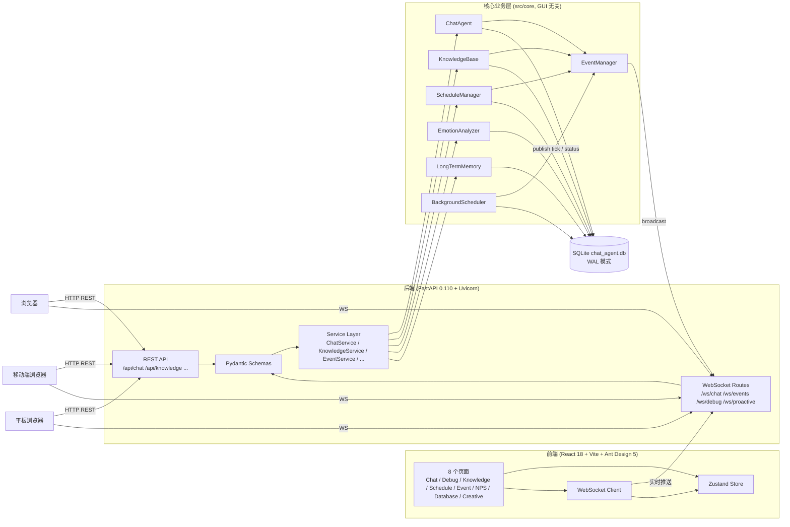

# Neo Agent Web 架构文档

本文档描述 Neo Agent v3.0.0 引入的 Web GUI（FastAPI + React）整体架构、数据流与部署模型。
Tkinter GUI 仍受支持（通过 `python main.py --tk` 启动），其架构参见 [`ARCHITECTURE.md`](ARCHITECTURE.md)。

---

## 1. 总体架构图（ASCII）

```
+----------------------------------------------------------------+
|                         浏览器 / 客户端                          |
|  (Chat / Debug / Knowledge / Schedule / Event / NPS / Database |
|        / Creative + React 18 + Vite 5 + Ant Design 5)           |
+--------------------+---------------------+----------------------+
                     | HTTP/REST           | WebSocket (full-dup)
                     v                     v
+----------------------------------------------------------------+
|          后端 FastAPI 0.110+ (Uvicorn, src/web/backend)         |
|  +-------------------+    +--------------------------------+   |
|  |  REST API         |    |  WebSocket 路由                 |   |
|  |  /api/chat        |    |  /ws/chat    (流式回复)         |   |
|  |  /api/knowledge   |    |  /ws/events  (EventManager)    |   |
|  |  /api/schedule    |    |  /ws/debug   (DebugLogger)     |   |
|  |  /api/events      |    |  /ws/proactive (主动消息)      |   |
|  |  /api/nps/...     |    +--------------------------------+   |
|  |  /api/database    |                                          |
|  |  /api/creative    |    Pydantic v2 Schemas                   |
|  +-------------------+    (强约束请求/响应)                      |
|              |                                                  |
|              v                                                  |
|  +----------------------------------------------------------+   |
|  |                  Service Layer (Service)                  |   |
|  |  ChatService / KnowledgeService / EventService /          |   |
|  |  ScheduleService / DatabaseService / CreativeService      |   |
|  +----------------------------------------------------------+   |
+----------------------------------------------------------------+
                              |
                              v
+----------------------------------------------------------------+
|       核心业务层 src/core  (GUI 无关, Tkinter / Web 共用)       |
|  ChatAgent  KnowledgeBase  ScheduleManager  EmotionAnalyzer     |
|  LongTermMemory  ProactiveEngine  BackgroundScheduler           |
|              EventManager  (单例, 总线)                         |
+----------------------------------------------------------------+
                              |
                              v
                  +-------------------------+
                  | SQLite chat_agent.db    |
                  | WAL mode (并发读安全)    |
                  +-------------------------+
```

三层职责：

- **前端 (Presentation)**：纯 UI + 状态管理 + WebSocket 订阅，不持有业务规则
- **后端 (Application)**：REST 路由 + WS 路由 + Service 编排 + Schema 校验
- **数据库 (Persistence)**：SQLite + WAL，业务层统一通过 `DatabaseManager` 访问

---

## 2. 前后端数据流

Neo Agent Web 端同时使用 **REST** 与 **WebSocket** 两种通信方式，按业务场景选型。

### 2.1 REST API（请求/响应模型）

适用于：单次调用、明确边界、需要缓存/重试的场景。

| 场景 | 示例端点 |
| --- | --- |
| 健康检查 | `GET /api/health` |
| 知识库查询 | `GET /api/knowledge` / `POST /api/knowledge/search` |
| 日程管理 | `GET/POST/PUT/DELETE /api/schedule/...` |
| 事件查询 | `GET /api/events` |
| NPS 状态 | `GET /api/nps/status` |
| 数据库元信息 | `GET /api/database/tables` |
| 创意生成 | `POST /api/creative/generate` |
| 非流式聊天 | `POST /api/chat`（同步返回完整回复） |

特点：
- 基于 Pydantic v2 做请求/响应 schema 校验
- 错误通过 HTTP 状态码 + JSON 体返回
- 前端用 **Axios** 调用，统一拦截器处理错误

### 2.2 WebSocket 端到端数据流（ASCII）

```
[浏览器 Chat 页]
    |   1) ws.send({type:"user_message", text:"hi"})
    v
[FastAPI /ws/chat]
    |
    v
[ChatService.handle_user_message]
    |
    v
[ChatAgent.chat_stream()]  <- 异步生成器
    |
    |   astream token ... token
    v
[ChatService]  yield {type:"token", delta:"..."}
    |
    v
[WebSocket Connection Manager]  broadcast(json)
    |
    v
[浏览器 Chat 页]  逐 token 渲染

[ChatAgent 完成]  yield {type:"done", full_text:"..."}
    |
    v
[ChatAgent]  EventManager.publish("chat_completed", payload)
    |
    v
[EventService]  (后台 task 把事件投到 /ws/events)
    |
    v
[浏览器]  监听 /ws/events 的 Debug / Event 页签更新
```

要点：
- 单次会话的 `chat_stream` 是一条 **async generator**，每段 token 都是一次 `yield`
- `EventManager` 单例：业务层 `publish` → `EventService` 桥接 → `/ws/events` 广播，**Web 层不直接侵入业务**
- 异常保护：单个 listener 抛错不会影响其他 listener（见 `EventManager.publish` try/except）

### 2.3 WebSocket（双向推送模型）

适用于：长连接、服务端主动推送、流式输出。

| 通道 | 推送内容 |
| --- | --- |
| `/ws/chat` | 单次会话的流式回复（token 级别）+ 完成事件 |
| `/ws/events` | 来自 `EventManager` 的全局事件（日程触发、主动消息、生命周期变化等） |
| `/ws/debug` | 调试日志流（来自 `DebugLogger`） |
| `/ws/proactive` | 主动消息推送（无需用户输入） |

特点：
- 单向广播（服务端 → 客户端）为主，客户端可发心跳
- 前端通过 `WebSocket Client`（hooks 层）订阅各通道
- 事件通过 `EventService` 单例从 `EventManager` 桥接，零侵入业务层

### 2.4 选型对照

| 维度 | REST | WebSocket |
| --- | --- | --- |
| 触发方 | 客户端 | 服务端/客户端皆可 |
| 实时性 | 请求后才返回 | 服务端可随时推送 |
| 适用 | CRUD、查询、配置变更 | 流式输出、事件广播 |
| 资源占用 | 短连接 | 长连接，少量并发 |
| 重试 | 易（HTTP 重试） | 需前端重连逻辑 |

---

## 3. 模块依赖图

依赖规则：**`src/core/*` 不依赖 `src/web/*`**；`src/web/*` 通过 Service 层包装 core，反向依赖。

```
+----------------------+         +-----------------------+
|  src/web/frontend    |  HTTP   |  src/web/backend      |
|  (React + Vite)      | ------> |  (FastAPI)            |
|                      |   WS    |                       |
+----------------------+ ------> +-----------+-----------+
                                         |
                                         | uses (Service wrapping)
                                         v
+----------------------+         +-----------------------+
|  src/web/backend     | ------> |  src/core/*           |
|  services/           |         |  ChatAgent,           |
|  (ChatService, ...)  |         |  KnowledgeBase,       |
+----------------------+         |  ScheduleManager, ... |
                                 |  EventManager,        |
                                 |  BackgroundScheduler  |
                                 +-----------+-----------+
                                             |
                                             v
                                 +-----------------------+
                                 |  src/tools/*          |
                                 |  (DebugLogger 等)     |
                                 +-----------+-----------+
                                             |
                                             v
                                 +-----------------------+
                                 |  chat_agent.db        |
                                 |  (SQLite, WAL)        |
                                 +-----------------------+
```

约束：

1. `src/core/*` **严禁** `import` 任何 `src/web/*`
2. `src/web/backend/services/*` 持有 `core` 对象的引用（通过构造注入或模块级单例）
3. `src/web/backend/api/*` 与 `src/web/backend/ws/*` **不直接**访问 `core`，统一通过 `services/`
4. `src/web/frontend` 与 `src/core/*` 之间没有任何代码引用；二者通过 HTTP/WS + JSON 通信
5. 允许的反向引用：core 内部模块互相引用；`web -> services -> core` 单向

这样在 v3.0.0 中替换为 Web GUI 时，**`src/core/*` 一行未改**，所有改动都被限制在 `src/web/*` 内。

---

## 4. 并行调度说明

Neo Agent v3.0.0 在同一进程内同时跑两类"长时间后台"组件：FastAPI/uvicorn 异步事件循环、BackgroundScheduler / EventManager 等后台线程。

### 4.1 BackgroundScheduler（独立子线程）

```
+------------------------------------------------------+
|  Python 主进程                                        |
|  +-------------------+      +----------------------+ |
|  | FastAPI / uvicorn |      |  BackgroundScheduler | |
|  |  (async event     |      |  (独立子线程,         | |
|  |   loop, 主循环)    |      |   asyncio.run 私有    | |
|  |                   |      |   event loop)         | |
|  +---------+---------+      +----------+-----------+ |
|            |                            |             |
|            |  await                     |  await     |
|            v                            v             |
|  +------------------------------------------+        |
|  |   EventManager 单例 (跨线程共享)          |        |
|  +------------------------------------------+        |
|            |                                          |
|            v                                          |
|  +------------------------------------------+        |
|  |   DatabaseManager 单例 (WAL, 线程安全)    |        |
|  +------------------------------------------+        |
+------------------------------------------------------+
```

要点：

- `BackgroundScheduler.start()` 启动一个 `daemon=True` 子线程
- 子线程内部用 `asyncio.run(...)` 跑自己的 event loop，**与 FastAPI 主循环物理隔离**
- 每个 tick（默认 60s）采集状态快照并通过 `EventManager.publish("scheduler_tick", payload)` 推送给订阅者
- 子线程异常由 scheduler 内部 try/except 兜住，**不会冒泡到 FastAPI 主循环**
- 关闭时由 `_stop_event` 触发优雅退出，等待 `self._thread.join(timeout=5)`

### 4.2 EventManager（单例，跨线程）

```
+----------+      publish("proactive_message")      +----------------+
|Proactive | --------------------------------------> | EventManager   |
|Engine    |                                        | (单例)         |
+----------+                                        +--------+-------+
                                                              | subscribe
+----------+      publish("scheduler_tick")                   |
|Background| --------------------------------------------+    |
|Scheduler |                                             |    |
+----------+                                             v    v
                                                  +-----+-----+----+
                                                  |  EventService |
                                                  |  (Web 后端)    |
                                                  +-------+-------+
                                                          | broadcast
                                                          v
                                                  +-------+-------+
                                                  | /ws/events    |
                                                  | 浏览器        |
                                                  +---------------+
```

要点：

- `EventManager` 是**进程内单例**，所有模块（包括 Tkinter / Web）共享同一个实例
- 订阅通过 `subscribe(event_type, callback)` 注册，回调签名 `callback(event_type, payload)`
- 业务层 `publish(...)` 调用零侵入；Web 端 `EventService` 在启动时 `subscribe("*", ...)` 接管广播
- publish 内部对每个 listener 都用 try/except 包裹，单个失败不影响其他订阅者

### 4.3 Web 端推送回路（与 Tkinter 共存）

- Web 模式：FastAPI 启动时 `EventService.start()`，把 EventManager 的事件投到 `/ws/events`
- Tkinter 模式：Tkinter 主循环直接读 `EventManager._listeners`（沿用旧有事件回调），不经过 `EventService`
- 两端互不干扰：WAL 模式下数据库可并发读，单写者安全

---

## 5. mermaid 总览图（参考）

> 本节与上方 ASCII 图表达同一架构；保留以便在支持 mermaid 的渲染器（GitLab / Obsidian）下阅读。



---

## 6. 数据共享

Web GUI 与 Tkinter GUI **完全共享同一份数据库**，无需数据迁移。

### 6.1 数据库位置

```
<project_root>/chat_agent.db
```

- SQLite 单一文件，相对路径存储
- **已启用 WAL 模式**（Stage E.3 期间在 `database_manager.py` 中开启），允许 Tkinter 与 Web 同时读写而不冲突
- 两端均通过 `DatabaseManager` 单例访问，业务层无差异

### 6.2 切换时数据一致性

| 场景 | 行为 |
| --- | --- |
| Tkinter 运行中切换到 Web | Tkinter 写完即关闭连接，Web 启动后立即可见新数据 |
| Web 运行中切换到 Tkinter | 同上 |
| 双端同时运行（不推荐） | WAL 模式可并发读，单写者安全；写入交错时由 SQLite 串行化保证一致性 |

### 6.3 共享的核心模块

以下模块由 Tkinter 与 Web 共用，**未做任何 GUI 耦合**：

- `src/core/chat_agent.py`（新增 `chat_stream()` 异步生成器）
- `src/core/knowledge_base.py`
- `src/core/schedule_manager.py`
- `src/core/emotion_analyzer.py`
- `src/core/long_term_memory.py`
- `src/core/database_manager.py`（WAL 模式）
- `src/core/background_scheduler.py`（每个 tick 推状态到 `EventManager`）
- `src/core/event_manager.py`（事件总线，Web 端 `EventService` 订阅它做 WS 广播）

---

## 7. 后台调度（速查）

`BackgroundScheduler` 是一个独立线程中的周期任务（默认 60s/tick），与 GUI 解耦：

- Web 模式：随 FastAPI 启动/停止
- Tkinter 模式：随 GUI 启动/停止
- 每个 tick 完成后通过 `EventManager` 发布状态事件，Web 端 `/ws/events` 可实时观察到调度器心跳

禁用方式：
- Web 模式：`python main.py --web --no-bg-scheduler`
- 全局：`.env` 中 `ENABLE_BACKGROUND_SCHEDULER=false`

---

## 8. 部署模型

### 8.1 开发态

```
[浏览器] ---HTTP/WS---> [Vite dev server :5173] ---proxy---> [FastAPI :8000]
                                                            |- EventService
                                                            `- BackgroundScheduler
```

### 8.2 生产态

```
[浏览器] ---HTTP/WS---> [Nginx/Caddy] ---> [FastAPI :8000 (uvicorn --workers N)]
                                       |- EventService
                                       `- BackgroundScheduler
```

前端使用 `npm run build` 产物（`dist/`）由 Nginx 直接提供。

---

## 9. 安全与并发

- 开发态：单进程单用户，仅本地/内网访问
- 生产态：建议加 Nginx 反向代理 + Basic Auth / OAuth 前置层
- WebSocket：每个连接一个独立 Task，自动随客户端断开清理
- 写入并发：SQLite WAL 模式 + 业务层加锁，串行化写

---

## 10. 参考

- [`ARCHITECTURE.md`](ARCHITECTURE.md) — 旧 Tkinter 时代模型/框架架构
- [`API.md`](API.md) — REST API 详细说明（待 Web 版本补全）
- [`TECHNICAL.md`](TECHNICAL.md) — 业务模块技术细节
- [`../README.md`](../README.md) — 项目入口
